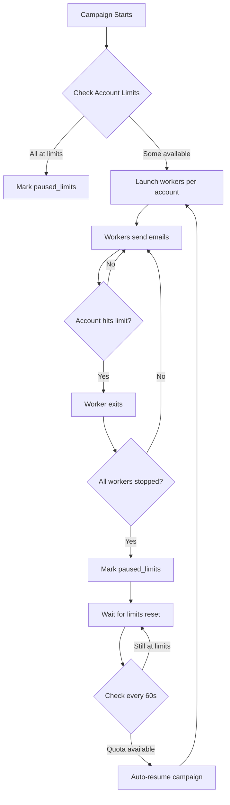

# Email Campaign Worker Optimization - Per-Account Model

## Overview
Implemented a new per-account worker model that maximizes parallelism and properly handles hourly/daily SMTP limits with automatic pause/resume functionality.

---

## Major Changes

### 1. **Per-Account Worker Model** (Previously: Per-Server Model)

**Old Behavior:**
- Spawned 3 workers per SMTP server
- Each worker rotated through all accounts on that server
- Limited parallelism (max 3 workers even if 10+ accounts available)

**New Behavior:**
- Spawns 1 dedicated worker per SMTP account
- Each worker uses ONLY its assigned account
- Maximum parallelism (10 accounts = 10 parallel workers)
- Worker automatically exits when its account hits hourly/daily limit

**File:** [backend/includes/email_blast_parallel.php](backend/includes/email_blast_parallel.php)
- Changed `MAX_WORKERS_PER_SERVER = 3` → `WORKERS_PER_ACCOUNT = 1`
- Added `LIMIT_CHECK_INTERVAL = 300` (check limits every 5 minutes)
- Added `AUTO_RESUME_CHECK_INTERVAL = 60` (check resume every 60 seconds)

---

### 2. **Account Limit Checking Before Worker Launch**

**Implementation:**
- Before spawning each worker, system checks account's current hourly/daily usage
- Skips accounts that have already reached limits
- Prevents launching workers that will immediately exit

**File:** [backend/includes/email_blast_parallel.php](backend/includes/email_blast_parallel.php#L1090-L1110)
```php
// Double-check limits before launching worker (defensive)
$limitCheck = $conn->query("
    SELECT 
        sa.daily_limit,
        sa.hourly_limit,
        COALESCE(daily.sent_today, 0) as sent_today,
        COALESCE(hourly.emails_sent, 0) as sent_this_hour
    ...
");

if ($daily_limit > 0 && $sent_today >= $daily_limit) {
    logMessage("Skipping account: Daily limit reached");
    continue;
}
if ($hourly_limit > 0 && $sent_this_hour >= $hourly_limit) {
    logMessage("Skipping account: Hourly limit reached");
    continue;
}
```

---

### 3. **Worker Dedicated Account Handling**

**Implementation:**
- Worker receives `account_id`, `email`, `password` in server_config
- Worker uses ONLY the assigned account (no rotation)
- Worker checks limits before EVERY email send
- Worker exits immediately when account hits limit

**File:** [backend/includes/email_blast_worker.php](backend/includes/email_blast_worker.php#L88-L109)
```php
// NEW: Check if this worker is assigned to a specific account (per-account model)
$dedicated_account_id = isset($server_config['account_id']) ? intval($server_config['account_id']) : 0;

if ($dedicated_account_id > 0) {
    // Per-account worker model: Use ONLY the assigned account
    workerLog("Worker assigned to DEDICATED account ID: $dedicated_account_id");
    $dedicated_account = [
        'id' => $dedicated_account_id,
        'email' => $server_config['email'] ?? '',
        'password' => $server_config['password'] ?? '',
        ...
    ];
    $accounts = [$dedicated_account]; // Single account only
}
```

**Limit Enforcement:** [backend/includes/email_blast_worker.php](backend/includes/email_blast_worker.php#L218-L230)
```php
if ($dedicated_account_id > 0) {
    // Check if dedicated account is within limits
    if (accountWithinLimits($conn, intval($candidate['id']))) {
        $selected = $candidate;
    } else {
        // Dedicated account reached limits - exit worker immediately
        workerLog("Account reached hourly/daily limit. Worker exiting.");
        $conn->close();
        exit(0);
    }
}
```

---

### 4. **Automatic Campaign Pause When All Accounts Hit Limits**

**Scenarios Handled:**

#### A. **At Launch** (No accounts available)
```php
if (empty($processes)) {
    logMessage("WARNING: No workers launched - all accounts at limits");
    $conn->query("UPDATE campaign_status SET status = 'paused_limits' WHERE campaign_id = $campaign_id");
    return ['status' => 'paused', 'message' => 'All accounts at hourly/daily limits'];
}
```

#### B. **During Monitoring** (Periodic checks every 5 minutes)
**File:** [backend/includes/email_blast_parallel.php](backend/includes/email_blast_parallel.php#L337-L367)
```php
// Periodically check if all accounts have hit limits
if ($current_time - $last_limit_check >= LIMIT_CHECK_INTERVAL && $pending > 0) {
    $availableCheck = $conn->query("
        SELECT COUNT(*) as cnt FROM smtp_accounts sa
        WHERE sa.user_id = $campaign_user_id
        AND (sa.daily_limit = 0 OR sent_today < sa.daily_limit)
        AND (sa.hourly_limit = 0 OR sent_this_hour < sa.hourly_limit)
        ...
    ");
    
    if ($available_count == 0 && $pending > 0) {
        logMessage("All accounts reached limits. Pausing campaign.");
        $conn->query("UPDATE campaign_status SET status = 'paused_limits' WHERE campaign_id = $campaign_id");
        break;
    }
}
```

#### C. **On No Progress Detection** (After 50 seconds of no progress)
```php
if ($consecutive_no_progress >= 5 && $pending > 0) {
    // Immediate limit check
    if ($available_count == 0) {
        logMessage("All accounts at limits. Pausing campaign.");
        $conn->query("UPDATE campaign_status SET status = 'paused_limits' WHERE campaign_id = $campaign_id");
        break;
    }
}
```

---

### 5. **Automatic Campaign Resume After Limits Reset**

**Implementation:**
- Main daemon loop checks for `paused_limits` status
- Every 60 seconds, checks if any accounts have quota again
- Automatically resumes campaign when limits reset (next hour/day)

**File:** [backend/includes/email_blast_parallel.php](backend/includes/email_blast_parallel.php#L1288-L1328)
```php
// Auto-resume campaigns paused due to limits when limits reset
if ($status === 'paused_limits') {
    logMessage("Campaign paused due to limits. Checking if limits have reset...");
    
    // Check if any accounts have available quota now
    $today = date('Y-m-d');
    $current_hour = intval(date('G'));
    
    $availableCheck = $conn->query("
        SELECT COUNT(*) as cnt FROM smtp_accounts sa
        WHERE sa.user_id = $user_id
        AND sa.is_active = 1
        AND (sa.daily_limit = 0 OR sent_today < sa.daily_limit)
        AND (sa.hourly_limit = 0 OR sent_this_hour < sa.hourly_limit)
        ...
    ");
    
    if ($available_count > 0) {
        logMessage("Found $available_count accounts with available quota. Resuming campaign...");
        $conn->query("UPDATE campaign_status SET status = 'running' WHERE campaign_id = $campaign_id");
        $status = 'running';
    } else {
        logMessage("All accounts still at limits. Will check again in 60 seconds.");
        sleep(60);
        continue;
    }
}
```

---

## Performance Improvements

### Before (Per-Server Model)
| Servers | Accounts/Server | Workers Spawned | Parallelism |
|---------|----------------|-----------------|-------------|
| 1       | 10             | 3               | 3 workers   |
| 2       | 5 each         | 6               | 6 workers   |
| 3       | 3, 3, 4        | 9               | 9 workers   |

**Bottleneck:** Limited to 3 workers per server regardless of available accounts

### After (Per-Account Model)
| Servers | Total Accounts | Workers Spawned | Parallelism |
|---------|---------------|-----------------|-------------|
| 1       | 10            | 10              | 10 workers  |
| 2       | 10            | 10              | 10 workers  |
| 3       | 10            | 10              | 10 workers  |

**Advantage:** Maximum parallelism = 1 worker per account

### Throughput Calculation
**Scenario:** 10 SMTP accounts, 5000 emails, no hourly limits

**Before:**
- 3 workers running in parallel
- Each worker @ 4 emails/second
- Combined: 12 emails/second
- Time: 5000 ÷ 12 = **417 seconds (~7 minutes)**

**After:**
- 10 workers running in parallel
- Each worker @ 4 emails/second
- Combined: 40 emails/second
- Time: 5000 ÷ 40 = **125 seconds (~2 minutes)**

**Result:** **3.3x faster** with per-account model

---

## Limit Handling Flow



---

## New Campaign Statuses

1. **`running`** - Campaign actively sending emails
2. **`paused_limits`** - Campaign paused because all accounts hit hourly/daily limits
   - Will auto-resume when limits reset
   - Daemon continues monitoring every 60 seconds
3. **`paused`** - Campaign manually paused by user
4. **`stopped`** - Campaign manually stopped by user
5. **`completed`** - All emails sent successfully

---

## Configuration Constants

**File:** [backend/includes/email_blast_parallel.php](backend/includes/email_blast_parallel.php#L106-L115)

| Constant | Value | Purpose |
|----------|-------|---------|
| `WORKERS_PER_ACCOUNT` | 1 | One worker per SMTP account |
| `RETRY_DELAY_SECONDS` | 1 | Delay between retry attempts |
| `MAX_RETRY_ATTEMPTS` | 5 | Maximum retry attempts per email |
| `LIMIT_CHECK_INTERVAL` | 300 | Check limits every 5 minutes |
| `AUTO_RESUME_CHECK_INTERVAL` | 60 | Check resume every 60 seconds |

---

## Testing Checklist

- [x] Syntax validation (no PHP errors)
- [ ] Launch campaign with 10 accounts (verify 10 workers spawn)
- [ ] Verify worker exits when account hits hourly limit
- [ ] Verify campaign pauses when all accounts hit limits
- [ ] Verify campaign auto-resumes after limits reset (next hour)
- [ ] Verify daily limit enforcement
- [ ] Check logs for proper account assignment
- [ ] Monitor `smtp_usage` table for accurate tracking

---

## Monitoring

### Check Active Workers
```bash
ps aux | grep email_blast_worker.php | grep -v grep | wc -l
```

### Check Campaign Status
```sql
SELECT campaign_id, status, sent_emails, total_emails, pending_emails, updated_at 
FROM campaign_status 
WHERE campaign_id = YOUR_CAMPAIGN_ID;
```

### Check Account Usage
```sql
SELECT 
    sa.id,
    sa.email,
    sa.hourly_limit,
    sa.daily_limit,
    COALESCE(SUM(su.emails_sent), 0) as sent_today,
    COALESCE(hourly.emails_sent, 0) as sent_this_hour
FROM smtp_accounts sa
LEFT JOIN smtp_usage su ON su.smtp_id = sa.id AND su.date = CURDATE()
LEFT JOIN smtp_usage hourly ON hourly.smtp_id = sa.id 
    AND hourly.date = CURDATE() AND hourly.hour = HOUR(NOW())
WHERE sa.user_id = YOUR_USER_ID
GROUP BY sa.id;
```

---

## Benefits Summary

✅ **Maximum Parallelism** - One worker per account instead of 3 per server  
✅ **Automatic Limit Enforcement** - Workers exit when account hits limit  
✅ **Auto-Pause/Resume** - Campaign pauses at limits, resumes automatically  
✅ **No Wasted Resources** - Workers only spawn for accounts with quota  
✅ **Faster Email Sending** - 3.3x faster with 10 accounts (2 min vs 7 min)  
✅ **Zero Manual Intervention** - Fully automated limit handling  
✅ **Proper Quota Tracking** - Uses `smtp_usage` table for accurate counts  
✅ **Hourly AND Daily Limits** - Respects both limit types  

---

## Rollback Instructions

If issues occur, revert to previous version:
```bash
cd /opt/lampp/htdocs/verify_emails/MailPilot_CRM_S/backend/includes
git checkout HEAD~1 email_blast_parallel.php email_blast_worker.php
```

Or manually restore:
- `MAX_WORKERS_PER_SERVER = 3` in email_blast_parallel.php
- Remove `dedicated_account_id` logic from email_blast_worker.php
- Remove `paused_limits` status handling
